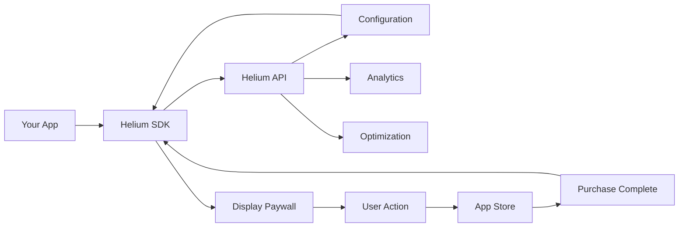

## Overview

Before diving into implementation, let's understand the core concepts that power Helium's paywall optimization platform.

## Key Concepts

### Paywalls

<Info>
  **Paywalls** are the screens in your app that present subscription options to users. Helium transforms these into dynamic, remotely configurable experiences.
</Info>

Paywalls in Helium consist of:
- **Templates** - Reusable designs that can be customized
- **Products** - The subscription tiers and pricing from your app stores
- **Content** - Text, images, and UI elements that can be edited remotely
- **Actions** - Purchase flows, dismissals, and navigation

### Triggers

**Triggers** are the points in your app where paywalls are displayed. Common triggers include:

<CardGroup cols={2}>
  <Card title="Onboarding" icon="door-open">
    After user completes initial setup
  </Card>
  <Card title="Feature Gate" icon="lock">
    When user tries premium features
  </Card>
  <Card title="Trial Expiry" icon="clock">
    When free trial is ending
  </Card>
  <Card title="Deep Link" icon="link">
    From marketing campaigns
  </Card>
</CardGroup>

Each trigger can have:
- Different paywall designs
- Unique product offerings
- Personalized messaging
- Specific targeting rules

### Experiments

<Steps>
  <Step title="Hypothesis">
    Define what you want to test (e.g., "Will a discount increase conversion?")
  </Step>
  <Step title="Variants">
    Create different versions of your paywall to test
  </Step>
  <Step title="Traffic Allocation">
    Decide what percentage of users see each variant
  </Step>
  <Step title="Analysis">
    Helium automatically tracks and analyzes results
  </Step>
</Steps>

### Personalization

Helium's AI-powered personalization automatically optimizes paywalls for different user segments:

- **User Attributes** - Country, device, app version
- **Behavioral Signals** - Usage patterns, engagement levels
- **Contextual Factors** - Time of day, day of week
- **Historical Data** - Previous purchases, dismissals

### Revenue Events

Understanding how Helium tracks revenue is crucial for optimization:

<Tabs>
  <Tab title="Purchase Events">
    - Initial purchase
    - Renewal
    - Upgrade/downgrade
    - Reactivation
  </Tab>
  <Tab title="Trial Events">
    - Trial start
    - Trial conversion
    - Trial cancellation
  </Tab>
  <Tab title="Refund Events">
    - Refund requested
    - Refund processed
  </Tab>
</Tabs>

## Architecture Overview

### How Helium Integrates

### Data Flow

1. **Configuration Download** - SDK fetches latest paywall configs
2. **Paywall Display** - SDK renders paywall based on trigger
3. **User Interaction** - Track views, taps, and purchases
4. **Revenue Tracking** - Monitor conversions and revenue
5. **Optimization** - AI adjusts for better performance

## Fallback System

Helium's fallback system ensures paywalls always work, even offline:

<Warning>
  **Always Configure Fallbacks**
  
  Starting with SDK v3.x, fallback configuration is mandatory to ensure your monetization never fails.
</Warning>

### Fallback Hierarchy

1. **Remote Configuration** - Latest from Helium servers
2. **Cached Configuration** - Previously downloaded configs
3. **Fallback Bundle** - Packaged with your app
4. **Fallback View** - Hard-coded last resort

## Analytics & Metrics

### Key Performance Indicators

<CardGroup cols={3}>
  <Card title="Conversion Rate" icon="percent">
    Users who purchase after seeing paywall
  </Card>
  <Card title="ARPU" icon="dollar-sign">
    Average Revenue Per User
  </Card>
  <Card title="LTV" icon="chart-line">
    Lifetime Value of customers
  </Card>
</CardGroup>

### Event Tracking

Helium automatically tracks:
- Paywall impressions
- Product selections
- Purchase attempts
- Successful conversions
- Dismissal reasons
- Time spent on paywall

## Security & Privacy

### Data Protection

- **Encryption** - All data transmitted using TLS 1.3
- **Authentication** - API keys with scope limitations
- **PII Handling** - No personal data stored by default
- **GDPR Compliant** - Full compliance with privacy regulations

### App Store Compliance

Helium ensures compliance with:
- Apple App Store guidelines
- Google Play policies
- StoreKit/Play Billing requirements
- Subscription management rules

## Best Practices

### Design Principles

<Tip>
  **Keep It Simple**
  
  The best converting paywalls are clear, concise, and focused on value.
</Tip>

1. **Clear Value Proposition** - What users get for their money
2. **Social Proof** - Reviews, ratings, testimonials
3. **Urgency** - Limited time offers when appropriate
4. **Trust Signals** - Security badges, guarantees
5. **Easy Dismissal** - Never trap users

### Testing Strategy

- Start with small changes
- Test one variable at a time
- Run tests for statistical significance
- Consider seasonality
- Document learnings

## Advanced Features

### Dynamic Pricing

Adjust prices based on:
- Geographic location
- Purchasing power parity
- Promotional periods
- User segments

### Multi-Product Strategies

- **Good/Better/Best** - Three tier pricing
- **Freemium** - Free tier with upgrades
- **Time-Limited** - Trial periods
- **Feature-Based** - Unlock specific features

### Workflow Automation

Create automated flows:
1. User completes onboarding → Show paywall
2. User hits usage limit → Offer upgrade
3. Subscription expires → Win-back campaign
4. High engagement user → Premium offer

## Next Steps

Now that you understand the core concepts:

<CardGroup cols={2}>
  <Card title="SDK Integration" icon="code" href="/sdk/quickstart-ios-v3">
    Add Helium to your app
  </Card>
  <Card title="Create First Paywall" icon="paint-brush" href="/getting-started/quickstart">
    Design your paywall
  </Card>
  <Card title="Revenue Setup" icon="chart-line" href="/guides/revenue-reporting">
    Configure analytics
  </Card>
  <Card title="Example Apps" icon="mobile" href="/sdk-reference/example-apps">
    See implementations
  </Card>
</CardGroup>

## Glossary

<Accordion title="Common Terms">
  - **ARPU** - Average Revenue Per User
  - **LTV** - Lifetime Value
  - **Churn** - Rate of subscription cancellations
  - **MRR** - Monthly Recurring Revenue
  - **Cohort** - Group of users with shared characteristics
  - **Variant** - Different version in an experiment
  - **Control** - Original version in an experiment
  - **Significance** - Statistical confidence in results
</Accordion>