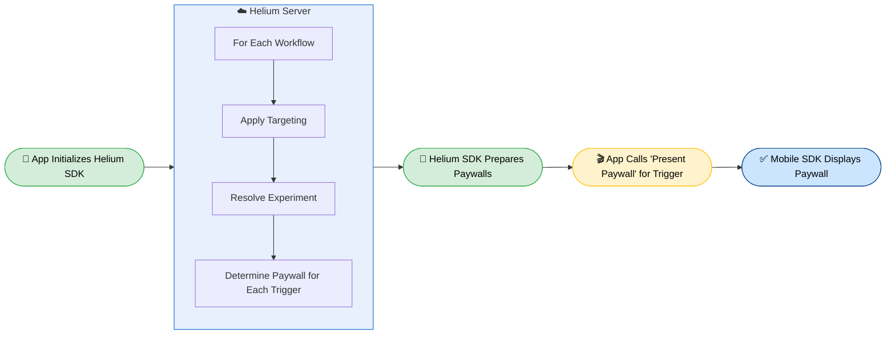

A general overview of how the Helium platform works.

# Useful Terms

<Card icon="rocket-launch" horizontal href="https://app.tryhelium.com/paywalls" title="Paywall">
  A visual display that contains subscription options and in-app purchases. Design paywalls using AI in your Helium dashboard.
</Card>

<Card icon="sitemap" horizontal href="https://app.tryhelium.com/workflows" title="Workflow">
  A configuration that defines which paywall to show to a user, with options for targeting and experiments.
</Card>

<Card icon="map-pin" horizontal href="https://app.tryhelium.com/workflows" title="Trigger">
  An identifier used in your mobile app integration to determine which workflow to use when displaying a paywall. One workflow can have multiple triggers.
</Card>

<Card icon="people-group" horizontal href="https://app.tryhelium.com/targeting" title="Targeting & Audiences">
  An "audience" is a segment of users that you define based on dimensions such as language, age, etc. Workflows can show different paywalls to different audiences.

  Your mobile app integration can define custom "user traits" for use in targeting.
</Card>

<Card icon="flask-round-potion" horizontal href="https://app.tryhelium.com/experiments" title="Experiments">
  An experiment is an A/B/n test that allows you to compare paywall A versus paywall B for a specific audience.
</Card>

# How do paywalls get displayed on my app?

This is an overview of how paywalls are actually served to users.

