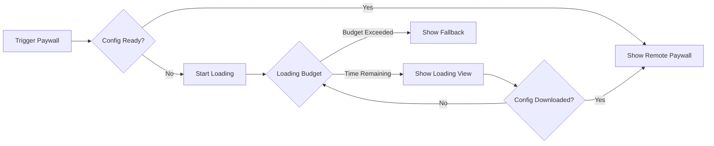

## Summary

<Warning>
  **Breaking Changes in v3.0:**
  - **Minimum iOS version**: Now requires iOS 15.0+ (up from iOS 14.0)
  - **Fallback configuration**: Now **required** - you must provide either a fallback bundle or fallback view
  - **New fallback system**: Uses `HeliumFallbackConfig` for configuration
  - **Default delegate**: Uses `StoreKitDelegate` by default if no delegate provided
</Warning>

<Info>
  **What's new:**
  - Event handlers can be passed directly in `presentUpsell`
  - Loading budgets during config downloads
  - Custom user traits can be passed per trigger
  - Protocol-based events available (enum-based still work)
</Info>

## Event Handlers in presentUpsell

You can now pass completion handlers directly when presenting paywalls.

### Before (v2.x)
```swift
Helium.shared.presentUpsell(trigger: "premium_upgrade")
```

### After (v3.0)
```swift
Helium.shared.presentUpsell(
    trigger: "premium_upgrade",
    onPresent: { paywallInfo in
        print("Showing paywall: \(paywallInfo.templateName)")
    },
    onDismiss: { result in
        switch result {
        case .purchased:
            unlockPremiumFeatures()
        case .dismissed:
            showAlternativeOptions()
        }
    }
)
```

## Loading Budget for Paywalls

In v2.x, if a Helium download was in progress but you wanted to show a paywall immediately (e.g., on app open), the Helium SDK would just show you a fallback paywall.

In v3.0, it'll now show a loading state (by default, a shimmer view for 2 seconds) and wait for the download to complete. You can configure, turn off, or set trigger-specific loading budgets (e.g., on app open you might want this behavior, but not in other parts of the app).

### How It Works



### Configure Loading Budgets

Set different loading budgets per trigger or globally:

```swift
let fallbackConfig = HeliumFallbackConfig(
    fallbackPaywall: YourFallbackView(),
    // Global loading budget (in seconds)
    loadingBudget: 2.0,
    // Per-trigger loading budgets
    loadingBudgetPerTrigger: [
        "onboarding": 3.0,      // More time for onboarding
        "quick_upgrade": 1.0,   // Less time for quick actions
        "trial_expiry": 2.5     // Balanced approach
    ]
)

Helium.shared.initialize(
    apiKey: "your-api-key",
    fallbackConfig: fallbackConfig
)
```

### Custom Loading Views

Provide custom loading views during the budget period:

```swift
let fallbackConfig = HeliumFallbackConfig(
    fallbackPaywall: YourFallbackView(),
    loadingView: { progress in
        VStack {
            ProgressView("Loading premium options...")
            Text("\(Int(progress * 100))% complete")
        }
    }
)
```

### Disable Loading Budget

To show fallback immediately without waiting:

```swift
let fallbackConfig = HeliumFallbackConfig(
    fallbackPaywall: YourFallbackView(),
    loadingBudget: 0 // Immediate fallback
)
```

## Required Fallbacks

Fallbacks are now mandatory. The SDK will fail to initialize without a fallback configuration.

### Before (v2.x)
```swift
Helium.shared.initialize(
    apiKey: "your-api-key",
    heliumPaywallDelegate: delegate,
    fallbackPaywall: nil // Could be nil
)
```

### After (v3.0)
```swift
let fallbackConfig = HeliumFallbackConfig(
    // Required: Basic fallback view
    fallbackPaywall: Text("Premium Features Available"),
    
    // Recommended: Fallback bundle
    fallbackBundleURL: Bundle.main.url(
        forResource: "HeliumFallback",
        withExtension: "bundle"
    )
)

Helium.shared.initialize(
    apiKey: "your-api-key",
    fallbackConfig: fallbackConfig
)
```

### Per-Trigger Fallbacks

Configure different fallbacks for different triggers:

```swift
let fallbackConfig = HeliumFallbackConfig(
    fallbackPaywall: DefaultFallbackView(),
    fallbackPaywallPerTrigger: [
        "onboarding": OnboardingFallbackView(),
        "premium_feature": PremiumFeatureFallbackView(),
        "trial_expiry": TrialExpiryFallbackView()
    ]
)
```

## Event System (Optional Migration)

The event system now supports protocol-based events, but your existing enum-based delegates will continue to work.

### Existing Code (Still Works)
```swift
// Your v2.x delegate code continues to work unchanged
func onHeliumPaywallEvent(event: HeliumPaywallEvent) {
    switch event {
    case .paywallOpen(let trigger, let template, _):
        analytics.track("paywall_open", trigger: trigger)
    case .purchaseCompleted(let productId):
        analytics.track("purchase", product: productId)
    default:
        break
    }
}
```

### New Option (Protocol-Based)
```swift
// Optionally migrate to new protocol-based events for additional data
func onHeliumPaywallEvent(event: any HeliumEvent) {
    if let openEvent = event as? PaywallOpenEvent {
        analytics.track("paywall_open", 
            trigger: openEvent.trigger,
            template: openEvent.templateName
        )
    } else if let purchaseEvent = event as? PurchaseCompletedEvent {
        analytics.track("purchase",
            product: purchaseEvent.productId,
            revenue: purchaseEvent.revenue
        )
    }
}
```

## StoreKit Delegate by Default

If no delegate is provided, v3.0 uses StoreKitDelegate automatically.

### Before (v2.x)
```swift
Helium.shared.initialize(
    apiKey: "your-api-key",
    heliumPaywallDelegate: StoreKitDelegate(), // Required
    fallbackPaywall: fallbackView
)
```

### After (v3.0)
```swift
Helium.shared.initialize(
    apiKey: "your-api-key",
    fallbackConfig: fallbackConfig
    // No delegate needed - StoreKitDelegate is default
)
```

## Custom User Traits in Triggers

You can now pass custom user traits when triggering a paywall, in addition to setting them during initialization.

### Before (v2.x)
```swift
// Traits could only be set during initialization
Helium.shared.initialize(
    apiKey: "your-api-key",
    customUserTraits: globalTraits
)

// No way to pass traits when showing paywall
Helium.shared.presentUpsell(trigger: "premium_upgrade")
```

### After (v3.0)
```swift
// Pass traits specific to this paywall trigger
let contextualTraits = HeliumUserTraits(traits: [
    "feature_attempted": "export_pdf",
    "usage_this_session": 15,
    "current_screen": "document_editor"
])

Helium.shared.presentUpsell(
    trigger: "premium_upgrade",
    customUserTraits: contextualTraits
)
```

## Minimum iOS Version

Update your app's minimum deployment target to iOS 15.0 or later.

### Xcode Project
1. Select your project in Xcode
2. Go to your app target
3. Set "Minimum Deployments" to iOS 15.0

### Package.swift
```swift
.platforms([
    .iOS(.v15) // Updated from .v14
])
```

## Quick Migration Checklist

- [ ] Update to Helium SDK 3.0.0 or later
- [ ] Set minimum iOS version to 15.0
- [ ] Add required fallback configuration
- [ ] Update event handling to new protocol-based system
- [ ] Test loading budgets for your triggers
- [ ] Verify fallback bundles are included
- [ ] Update any custom delegates
- [ ] Test purchase flows


## Need Help?

- Review the [iOS SDK Quickstart](/sdk/quickstart-ios)
- Check our [Example Apps](/sdk-reference/example-apps)
- See the [Complete Example App](https://github.com/cloudcaptainai/example-helium-swift) on GitHub
- Contact support via Slack or [founders@tryhelium.com](mailto:founders@tryhelium.com)