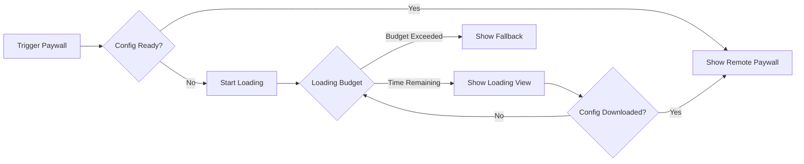

## Summary

<Note>
  React Native & Flutter: This guide applies for anyone upgrading React Native / Flutter from 0.x.x to 3.0.x. React Native and Flutter did not have a major version 1 or 2.
</Note>

<Warning>
  **Breaking Changes in v3.0:**

  - **Minimum iOS version**: Now requires iOS 15.0+ (up from iOS 14.0)
</Warning>

<Info>
  **What's new:**

  - Event handlers can be passed directly to `presentUpsell`
  - Loading budgets for paywall downloads
  - [Improved event system](/sdk/helium-events)
  - StoreKitDelegate used by default (iOS only)
  - `customPaywallTraits` can be set when showing a paywall
</Info>

## Event Handlers in presentUpsell

You can now pass completion handlers directly when presenting paywalls.

### Before v3

```swift
Helium.shared.presentUpsell(trigger: "premium_upgrade")
```

### v3

```swift
Helium.shared.presentUpsell(
    trigger: "premium_upgrade",
    eventHandlers: PaywallEventHandlers()
        .onOpen { event in
            print("\(event.paywallName) via trigger \(event.triggerName)")
        }
        .onClose { event in
            print("\(event.paywallName) for trigger \(event.triggerName)")
        }
        .onDismissed { event in
            print("\(event.paywallName) for trigger \(event.triggerName)")
        }
        .onPurchaseSucceeded { event in
            print("\(event.paywallName) for trigger \(event.triggerName)")
        }
)
```

## Loading Budget for Paywalls

Before v3, if a Helium download was in progress but you wanted to show a paywall immediately (e.g., on app open), the Helium SDK would just show you a fallback paywall.

In v3.0, it'll now show a loading state (by default, a shimmer view for 2 seconds) and wait for the download to complete. You can configure, turn off, or set trigger-specific loading budgets.

### How It Works



### Configure Loading Budgets

Set different loading budgets per trigger or globally:

<CodeGroup>

```swift iOS
let fallbackConfig = HeliumFallbackConfig(
    fallbackView: YourFallbackView(),
    // Global loading budget (in seconds)
    loadingBudget: 2.0,
    // Per-trigger loading budgets
    loadingBudgetPerTrigger: [
        "onboarding": 3.0,      // More time for onboarding
        "quick_upgrade": 1.0,   // Less time for quick actions
        "trial_expiry": 2.5     // Balanced approach
    ]
)

Helium.shared.initialize(
    apiKey: "your-api-key",
    fallbackConfig: fallbackConfig
)
```


```tsx React Native
const paywallLoadingConfig: HeliumPaywallLoadingConfig = {
  useLoadingState: true,
  loadingBudget: 4,
  perTriggerLoadingConfig: {
    "onboarding": {
      loadingBudget: 5,
    },
    "trial": {
      useLoadingState: false,
    }
  },
};

initialize({
  apiKey: "helium-api-key",
  purchaseConfig: createRevenueCatPurchaseConfig(
    {apiKey: 'rc-api-key'}
  ),
  onHeliumPaywallEvent: (event: HeliumPaywallEvent) => {
    console.log('Helium Paywall Event:', event);
  },
  fallbackBundle: require('./assets/fetched.json'),
  paywallLoadingConfig: paywallLoadingConfig, // << pass to initialize
});
```


```dart Flutter
// Flutter v3 support coming soon!
```

</CodeGroup>

### Custom Loading Views (iOS only)

Provide custom loading views during the budget period:

```swift
let fallbackConfig = HeliumFallbackConfig(
    fallbackView: YourFallbackView(),
    loadingView: { progress in
        VStack {
            ProgressView("Loading premium options...")
            Text("\(Int(progress * 100))% complete")
        }
    }
)
```

### Disable Loading Budget

To show fallback immediately without waiting:

```swift
let fallbackConfig = HeliumFallbackConfig(
    fallbackView: YourFallbackView(),
    useLoadingState: false // Immediate fallback
)
```

## Required Fallbacks (iOS only)

Fallbacks are mandatory. You must either provide a `fallbackConfig`  (v3.0 way) or a `fallbackPaywall` (old way). The SDK will fail to initialize without some type of fallback configuration.

### Before (v2.x)

```swift
Helium.shared.initialize(
    apiKey: "your-api-key",
    heliumPaywallDelegate: delegate,
    fallbackPaywall: YourFallbackView()
)
```

### After (v3.0)

```swift
let fallbackConfig = HeliumFallbackConfig(
    // Required: Basic fallback view
    fallbackView: Text("Premium Features Available"),

    // Recommended: Fallback bundle
    fallbackBundle: Bundle.main.url(
        forResource: "fallback-bundle",
        withExtension: "json"
    )
)

Helium.shared.initialize(
    apiKey: "your-api-key",
    fallbackConfig: fallbackConfig
)
```

### Per-Trigger Fallbacks

Configure different fallbacks for different triggers:

```swift
let fallbackConfig = HeliumFallbackConfig(
    fallbackView: DefaultFallbackView(),
    fallbackPerTrigger: [
        "onboarding": OnboardingFallbackView(),
        "premium_feature": PremiumFeatureFallbackView(),
        "trial_expiry": TrialExpiryFallbackView()
    ]
)
```

## Event System Changes

The event system now uses protocol-based events with better type safety and IDE support.

### Key Event Changes From Before v3

#### Name Changes

- `paywallTemplateName` → `paywallName`
- `productKey` → `productId`
- All `subscription*` events → `purchase*` events (e.g., `subscriptionSucceeded` → `PurchaseSucceededEvent`)
- `ctaPressed` event → `PaywallButtonPressedEvent`
- `error` is now `Error` type instead of `String` on `PurchaseFailedEvent`

<Note>
  React Native had several changes to event `type`:

  - ctaPressed → paywallButtonPressed
  - offerSelected → productSelected
  - subscriptionPressed →  purchasePressed
  - subscriptionCancelled →  purchaseCancelled
  - subscriptionSucceeded →  purchaseSucceeded
  - subscriptionFailed →  purchaseFailed
  - subscriptionRestored →  purchaseRestored
  - subscriptionRestoreFailed →  purchaseRestoreFailed
  - subscriptionPending →  purchasePending
</Note>

#### Removed

- `configId` removed from download success events

### New Delegate Method (iOS only)

#### Before v3

`onHeliumPaywallEvent(event:)` (deprecated but still works)

```swift
func onHeliumPaywallEvent(event: HeliumPaywallEvent) {
    switch event {
    case .paywallOpen(let trigger, let paywallTemplateName, _):
        analytics.track("paywall_open", trigger: trigger)
    case .subscriptionSucceeded(let productKey, let trigger, _):
        analytics.track("purchase", product: productKey)
    case .subscriptionFailed(let productKey, _, _, let errorString):
        print("Purchase failed: \(errorString ?? "unknown")")
    default:
        break
    }
}
```

#### v3

`onPaywallEvent(_:)` (recommended)

```swift
func onPaywallEvent(_ event: PaywallEvent) {
    switch event {
    case let openEvent as PaywallOpenEvent:
        analytics.track("paywall_open",
            trigger: openEvent.triggerName,
            paywall: openEvent.paywallName
        )
    case let purchaseEvent as PurchaseSucceededEvent:
        analytics.track("purchase",
            product: purchaseEvent.productId
        )
    case let failedEvent as PurchaseFailedEvent:
        if let error = failedEvent.error {
            print("Purchase failed: \(error.localizedDescription)")
        }
    default:
        break
    }
}
```

## StoreKit Delegate by Default (iOS only)

If no delegate is provided, v3.0 uses StoreKitDelegate automatically.

### Before (v2.x)

```swift
Helium.shared.initialize(
    apiKey: "your-api-key",
    heliumPaywallDelegate: StoreKitDelegate(), // Required
    fallbackPaywall: fallbackView
)
```

### After (v3.0)

```swift
Helium.shared.initialize(
    apiKey: "your-api-key",
    fallbackConfig: fallbackConfig
    // No delegate needed - StoreKitDelegate is default
)
```

## Custom Paywall Traits

You can now pass custom paywall traits when displaying a paywall, replacing the deprecated `HeliumPaywallDelegate.getCustomVariableValues` method.

```swift
Helium.shared.presentUpsell(
    trigger: "premium_upgrade",
    customPaywallTraits: [
        "feature_attempted": "export_pdf",
        "usage_this_session": 15,
        "current_screen": "document_editor"
    ]
)
```

## Minimum iOS Version

Update your app's minimum deployment target to iOS 15.0 or later.

<Tabs>
  <Tab title="iOS">
    1. Select your project in Xcode
    2. Go to your app target
    3. Set "Minimum Deployments" to iOS 15.0
  </Tab>
  <Tab title="React Native">
    If using Expo:

    1. Make sure the `expo-build-properties` package is installed (should be installed by default)
    2. Update your app config (app.json, app.config.js, app.config.ts):

    ```json
    [
      "expo-build-properties",
      {
        ios: {
          deploymentTarget: "15.0", // or higher
        },
      },
    ],
    ```

    If not using Expo, adjust in your Xcode project directly.
  </Tab>
  <Tab title="Flutter">
    Flutter v3 support coming soon!
  </Tab>
</Tabs>

## Need Help?

- Review the [iOS SDK Quickstart](/sdk/quickstart-ios)
- See the [Complete Example App](https://github.com/cloudcaptainai/example-helium-swift) on GitHub
- Contact support via Slack or [founders@tryhelium.com](mailto:founders@tryhelium.com)
